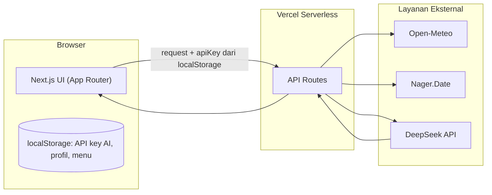

# BizPulse

**Kesadaran situasional harian untuk usaha kecil.**

BizPulse menggabungkan data cuaca, kalender hari besar, dan katalog produk milik pengguna menjadi satu rekomendasi aksi harian yang dihasilkan AI — dirancang supaya pemilik usaha kecil tidak lagi mengambil keputusan operasional (stok, promosi, waktu antisipasi) berdasarkan feeling semata.

---

## Daftar Isi

- [Masalah yang Diselesaikan](#masalah-yang-diselesaikan)
- [Fitur](#fitur)
- [Tech Stack](#tech-stack)
- [Arsitektur](#arsitektur)
- [Struktur Proyek](#struktur-proyek)
- [Memulai (Development)](#memulai-development)
- [Environment Variables](#environment-variables)
- [Integrasi API — Detail](#integrasi-api--detail)
- [Sistem Desain](#sistem-desain)
- [Deployment](#deployment)
- [Lisensi](#lisensi)
- [Kontak](#kontak)

---

## Masalah yang Diselesaikan

Banyak keputusan operasional harian di usaha kecil — mau siapin stok berapa, kapan waktu tepat promosi, kapan harus lebih waspada — masih diputuskan berdasarkan feeling. Bukan karena pemiliknya malas, tapi karena tidak ada sistem yang membuat data eksternal (cuaca, kalender, momentum pasar) mudah diakses dan langsung actionable dalam hitungan detik.

BizPulse dibangun untuk mengisi gap itu: mengubah kesadaran lingkungan (*environmental awareness*) dari kebiasaan yang sering diabaikan menjadi sesuatu yang otomatis tersedia setiap hari.

## Fitur

- **Rekomendasi harian berbasis AI** — menggabungkan prakiraan cuaca, kalender hari besar Indonesia, dan katalog produk pengguna menjadi satu rekomendasi aksi konkret, disertai tingkat keyakinan (*confidence*) dan alasan yang bisa ditelusuri.
- **Chat lanjutan** — pengguna bisa bertanya lebih lanjut ke AI tentang rekomendasi hari itu, dengan konteks bisnis yang sama tanpa perlu dijelaskan ulang.
- **Profil Bisnis** — nama usaha, lokasi (address search), kategori usaha, status delivery, dan bidang adaptif sesuai kategori, yang semuanya memengaruhi kualitas rekomendasi. Setup pertama kali lewat alur bertahap (satu pertanyaan per langkah); mengedit lewat form penuh.
- **Menu & Produk** — unggah katalog produk lewat foto, PDF, atau spreadsheet; diekstrak otomatis menjadi data terstruktur yang menjadi basis pengetahuan AI, dengan tabel hasil ekstraksi yang bisa dikoreksi sebelum disimpan.
- **Bawa API key sendiri** — pengguna menghubungkan API key AI mereka sendiri lewat halaman Pengaturan (disimpan hanya di browser, tidak pernah ke server kami).
- **Command palette** (Cmd/Ctrl+K) untuk lompat ke halaman mana pun.
- **Mode terang/gelap**, sepenuhnya responsif di mobile (sidebar → bottom tab bar).

## Tech Stack

| Layer | Teknologi |
|---|---|
| Framework | Next.js (App Router) |
| UI Components | shadcn/ui (Base UI primitives) |
| Ikon | Lucide |
| Styling | Tailwind CSS |
| Tipografi | Geist Sans, Geist Mono |
| AI | DeepSeek API (`deepseek-v4-flash`, OpenAI-compatible), dipanggil lewat Vercel AI SDK (`streamObject`/`useObject` untuk Recommendation Card, `streamText`/`useChat` untuk chat) |
| Data cuaca | [Open-Meteo](https://open-meteo.com/) — gratis, tanpa API key |
| Data kalender | [Nager.Date](https://date.nager.at/) — gratis, tanpa API key |
| Validasi form | react-hook-form + zod |
| Parsing file | `pdf-parse` (PDF), `xlsx`/SheetJS (spreadsheet), `react-dropzone` (upload) |
| Deployment | Vercel |

## Arsitektur

### Alur data harian

```mermaid
flowchart TD
    A[User membuka Beranda] --> B{Lokasi bisnis tersimpan?}
    B -->|Tidak| C[Empty state: lengkapi Profil Bisnis]
    B -->|Ya| D[Fetch cuaca — Open-Meteo]
    B -->|Ya| E[Fetch kalender — Nager.Date]
    D --> F[Gabungkan: cuaca + kalender + Profil Bisnis + Menu Produk]
    E --> F
    F --> G[/api/insight]
    G --> H[DeepSeek API via Vercel AI SDK — streamObject]
    H --> I[Recommendation Card ter-stream ke client]
    I --> J{Aksi user}
    J --> K[Simpan]
    J --> L[Chat lebih lanjut — /api/chat, konteks yang sama terbawa]
```

### Lapisan sistem



**Catatan penting soal API key:** API key AI milik pengguna **tidak pernah disimpan di server**. Key dikirim dari `localStorage` browser ke API Route per-permintaan, diteruskan langsung ke DeepSeek, lalu dibuang — bukan disimpan sebagai environment variable global. Karena itu, deploy dasar BizPulse ke Vercel **tidak memerlukan API key AI sebagai project secret** — setiap pengguna membawa key mereka sendiri lewat halaman Pengaturan.

## Struktur Proyek

```
bizpulse/
├── src/
│   ├── app/
│   │   ├── page.tsx                  # Beranda — day-strip + Recommendation Card
│   │   ├── profile/page.tsx          # Profil Bisnis (wizard first-time / form saat edit)
│   │   ├── menu/page.tsx             # Menu & Produk
│   │   ├── settings/page.tsx         # Pengaturan (API key)
│   │   ├── about/page.tsx            # Tentang
│   │   ├── api/
│   │   │   ├── insight/route.ts      # streamObject — Recommendation Card
│   │   │   ├── chat/route.ts         # streamText — chat lanjutan
│   │   │   ├── verify-key/route.ts   # Test koneksi API key
│   │   │   └── menu/
│   │   │       ├── extract-image/route.ts
│   │   │       └── extract-pdf/route.ts
│   │   ├── favicon.ico / icon.svg / apple-icon.png / manifest.ts
│   │   └── globals.css
│   ├── components/
│   │   ├── ui/                       # shadcn components (Badge di-override ke rounded-full, lihat Sistem Desain)
│   │   ├── dashboard.tsx, day-strip.tsx, recommendation-card.tsx, chat-panel.tsx, ...
│   │   └── app-shell.tsx             # Sidebar + bottom tab bar + command palette
│   ├── lib/
│   │   ├── weather.ts                # Open-Meteo
│   │   ├── holidays.ts               # Nager.Date
│   │   ├── recommendation-schema.ts  # Zod schema bersama server/client
│   │   ├── local-store.ts            # Wrapper localStorage (profil, menu, API key)
│   │   └── types.ts
│   └── hooks/
├── public/
│   ├── logo/bizpulse-logo-{light,dark}-mode.svg
│   └── icon-192.png / icon-512.png
```

## Memulai (Development)

### Prasyarat
- Node.js 20+
- Akun DeepSeek (untuk testing lokal — buat API key di [platform.deepseek.com](https://platform.deepseek.com))

### Instalasi

```bash
git clone https://github.com/IPutuDanaPutra/bizpulse.git
cd bizpulse
npm install
npm run dev
```

Buka [http://localhost:3000](http://localhost:3000). API key AI dimasukkan langsung dari halaman Pengaturan di aplikasi (tidak lewat file `.env` — lihat catatan arsitektur di atas).

## Environment Variables

| Variabel | Wajib? | Keterangan |
|---|---|---|
| `NEXT_PUBLIC_DEFAULT_COUNTRY` | Tidak | Default `ID`. Dipakai untuk query Nager.Date. |

Tidak ada key AI yang perlu diset sebagai environment variable — lihat [Arsitektur](#arsitektur).

## Integrasi API — Detail

### Open-Meteo (cuaca)
```
GET https://api.open-meteo.com/v1/forecast?latitude={lat}&longitude={lon}&daily=weathercode,temperature_2m_max,temperature_2m_min,precipitation_sum,precipitation_probability_max,windspeed_10m_max,uv_index_max&timezone=Asia/Jakarta&forecast_days=16
```
Tanpa API key. `{lat}`/`{lon}` **wajib** berasal dari lokasi tersimpan di Profil Bisnis pengguna — lihat catatan fallback di bawah.

### Nager.Date (kalender)
```
GET https://date.nager.at/api/v3/NextPublicHolidays/ID
```
Tanpa API key. Data pasti (bukan prakiraan), aman ditampilkan jauh ke depan.

### DeepSeek (AI)
```
Base URL: https://api.deepseek.com
Model: deepseek-v4-flash
```
Model lama (`deepseek-chat`, `deepseek-reasoner`) sudah retired — jangan gunakan nama model itu.

**Fallback lokasi:** jika pengguna belum melengkapi lokasi di Profil Bisnis, Beranda **tidak** memanggil Open-Meteo dengan lokasi default apa pun — akan menampilkan empty state yang mengarahkan ke Profil Bisnis. Ini disengaja: menampilkan cuaca lokasi yang salah lebih buruk daripada tidak menampilkan apa-apa.

## Sistem Desain

- **Warna primer:** `#FF1616` (diambil dari logogram logo), dipakai sangat terbatas — momen AI, status aktif, tombol utama.
- **Palet dasar:** grayscale zinc (`--zinc-50` hingga `--zinc-950`), mendukung mode terang/gelap penuh lewat `next-themes`.
- **Tipografi:** Geist Sans (judul & isi), Geist Mono (angka & data).
- **Chip/badge:** satu bentuk konsisten di seluruh aplikasi — pil penuh (`rounded-full`), termasuk override terhadap default shadcn `Badge`.
- **Chip AI:** gradasi solid `#FF1616 → #FF7A45` dengan teks putih — dipakai khusus menandai konten hasil AI, tidak dipakai di tempat lain. Border gradasi berputar dipakai hanya saat AI sedang aktif men-generate, tidak pernah di keadaan idle.

## Deployment

Lihat langkah lengkap di [`DEPLOYMENT.md`](./DEPLOYMENT.md).

Ringkas: hubungkan repo ini ke [Vercel](https://vercel.com/new), framework preset terdeteksi otomatis sebagai Next.js, tidak ada secret wajib untuk build dasar (lihat [Environment Variables](#environment-variables)), lalu Deploy.

## Lisensi

Hak cipta © 2026 I Putu Dana Putra. Seluruh hak dilindungi.

## Kontak

- LinkedIn: [linkedin.com/in/iputudanaputra](https://www.linkedin.com/in/iputudanaputra/)
- GitHub: [github.com/IPutuDanaPutra](https://github.com/IPutuDanaPutra)
